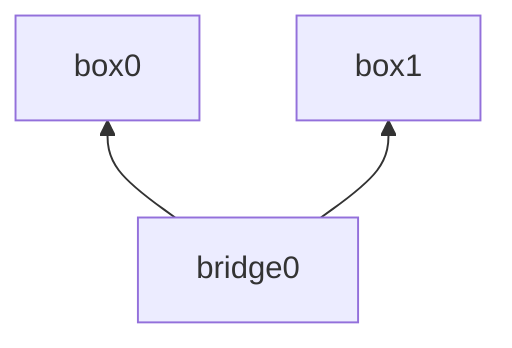

# Linux Bridge

Inspect address of the boxes:

    ip netns exec box0 ip addr show dev eth0
    ip netns exec box1 ip addr show dev eth0

Inspect the bridge ports:

    bridge link show bridge0

Inspect the forwarding table:

    bridge fdb show bridge0

Verfiy both boxes can ping each other:

     ip netns exec box0 ping 192.168.1.101
     ip netns exec box1 ping 192.168.1.100
