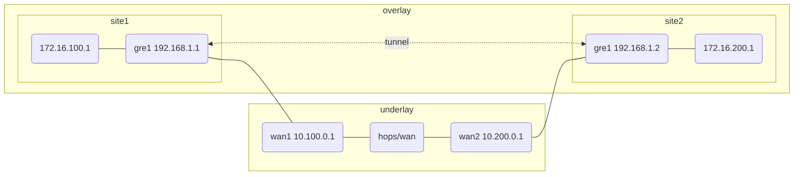

# GRE Tunnel

This example demonstrates a site-to-site GRE tunnel between two Linux
routers using network namespaces and virtual Ethernet pairs.

> [!NOTE]  
> This example requires the `ip_gre` kernel module.  



After bringing up the topology, a GRE tunnel is established between the
two sites using their public (WAN) addresses as endpoints. This tunnel
provides an overlay network that allows hosts in the private LAN of each
site to communicate as if they were directly connected, even though
packets traverse an untrusted WAN segment.

To illustrate the effect of the tunnel, compare traceroutes before and
after the GRE tunnel is established. For example, from a device in
`lan1` to a device in `lan2`:

**Without GRE tunnel (direct routing not possible):**

```sh
ip netns exec lan1 traceroute 172.16.200.1
```

Output:

```console
$ traceroute to 172.16.200.1, 30 hops max, 60 byte packets
 1  172.16.100.254  0.123 ms  0.084 ms  0.076 ms
 2  * * *
```

No route exists beyond the local site gateway.

**With GRE tunnel:**

```sh
ip netns exec lan1 traceroute 172.16.200.1
```

Output:

```console
$ traceroute to 172.16.200.1, 30 hops max, 60 byte packets
 1  172.16.100.254  0.110 ms  0.099 ms  0.094 ms
 2  192.168.1.2     0.320 ms  0.315 ms  0.310 ms
 3  172.16.200.1    0.410 ms  0.400 ms  0.395 ms
```

Now, packets are encapsulated and traverse the GRE tunnel interface
(192.168.1.2), arriving at the remote LAN.

The GRE tunnel effectively bridges the private subnets across the WAN,
enabling direct communication between otherwise isolated network
namespaces.

For more details, see comments in `setup.sh`.
