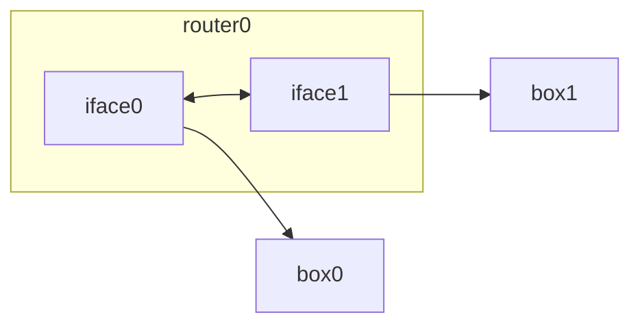

# IP Forwarding

```mermaid
graph LR
    subgraph router0
        iface0<-->iface1
    end
    iface0 --> box0
    iface1 --> box1
```

Test the connectivity between two hosts:

    sudo ip netns exec box0 ping -I router0 192.168.1.254
    sudo ip netns exec box1 ping -I router0 192.168.0.254
