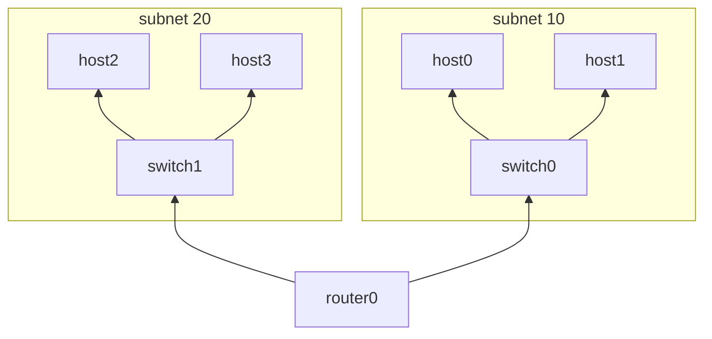

# Routing

Check on the resources:

    echo router
    sudo ip netns exec router0 ip -br addr
    echo switches
    for n in {0..1}; do sudo ip netns exec switch$n ip -br addr; done
    echo hosts
    for n in {0..3}; do sudo ip netns exec host$n ip -br addr show eth0; done

Test intra subnet connectivity:

    sudo ip netns exec host0 ping -c 1 -I eth0 192.168.0.101
    sudo ip netns exec host2 ping -c 1 -I eth0 192.168.1.100
  
Test cross subnet connectivity:

    sudo ip netns exec host0 ping -c 1 -I eth0 192.168.1.101
    sudo ip netns exec host2 ping -c 1 -I eth0 192.168.0.100
