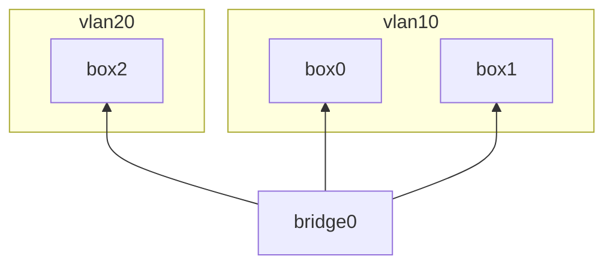

# VLAN Tagging

Check if vlan filtering is enabled on the bridge:

    cat /sys/class/net/bridge0/bridge/vlan_filtering

Enable it, if necessary:

    ip link set dev bridge0 type bridge vlan_filtering 1

Inspect the vlan configuration:

    bridge vlan show bridge0

By default vlan tagging is enabled and all devices are part of vlan 1
with untagged ports. Therefore devices can communicate, even when vlan
filtering is enabled:

    ip netns exec box0 ping -I eth0 192.168.1.101
    ip netns exec box0 ping -I eth0 192.168.1.102

Assign vlan tags to ports to separate traffic:

    bridge vlan add dev veth0 vid 10 pvid untagged
    bridge vlan add dev veth1 vid 10 pvid untagged
    bridge vlan add dev veth2 vid 20 pvid untagged

box0 can still ping box1:

    ip netns exec box0 ping -I eth0 192.168.1.101

But it cannot ping box2:

    ip netns exec box0 ping -I eth0 192.168.1.102

Note, that in this scenario, the vlan tags are internal to the bridge
and not visible to the host. However, it is possible to create
sub-interfaces for each vlan tag, and integrate them with the network
topology, i.e. as [trunk ports](../trunk-ports/) to a router. This be
will covered in a later example.
