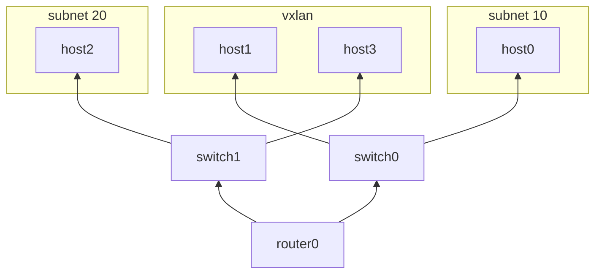

# VXLAN

This example depends on the [routing and switching network topology][1].
Run its setup.batch script first. Additionally, run its cleanup script
at the end.

Testing connectivity:

    ip netns exec host1 ping -c 1 -I eth0 172.16.0.101
    ip netns exec host3 ping -c 1 -I eth0 172.16.0.100

Observing VXLAN traffic:

    ip netns exec switch0 tcpdump -i vxlan0 -n -e -vvv
    ip netns exec switch1 tcpdump -i vxlan0 -n -e -vvv

[1]: ./../routing-and-switching/README.md
